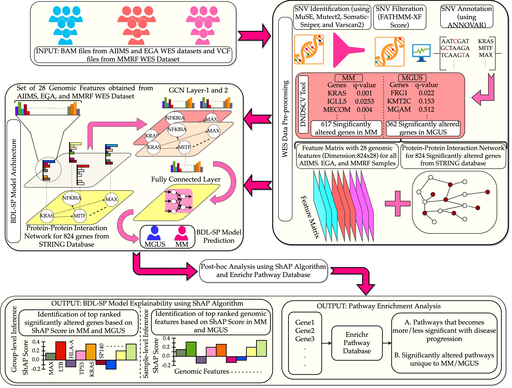

# AI-based workflow for the Identification of pivotal biomarkers that distinguish MGUS and MM



## Introduction

This repository contains all the codes for the classsification of MGUS and MM and identification of pivotal biomarkers that helps to distinguish the MGUS and MM using AI-based workflow.

## Project Structure
```
|----- BDL_SP_Model_results
          |----- Supplementory_File_1_Significant_Genes.xlsx
          |----- Supplementory_File_2_significant_pathways_MM_MGUS.xlsx
          |----- Supplementory_File_3_SHAP_Analysis_Beeswarm_plot.xlsx
          |----- Supplementory_File_4_combinedSHAPRanking.xlsx
          |----- Supplementory_File_5_Sanky_Diagrams.docx
          |----- Supplementory_File_6_Graph_Convolutional_Network.docx
          |----- Supplementory_File_7_Pseudo_codes_best_shap_score_estimation.docx

|----- LICENSE
|----- figures
          |----- bdl-sp-architecture_v6.jpg
|----- src
          |----- bdl-sp-top-feature-extraction.py
          |----- Notebooks
                   |----- BDL_SP_SHAP_Analysis.ipynb
                   |----- samplewise_shap_analysis.ipynb
                   |----- shap_individual_feature_plot.ipynb
|----- README.md
|----- requirements.txt

```

### System Requirements

Presently, ML codes are tested only for the Linux OS.
##### LINUX Operating System:

System Requirements:

• 64bit, 8.00 GB RAM

• OS version used for this pipeline: Ubuntu 18.04.

### Prerequisites

All the prequisites are mentioned in requirements.txt

### Data Preparation for model training
1. Started with  BAM files from WES data.
2. Generated vcf filef from 4 variant callers softwares i.e. MuSE, Mutect2, Somatic-Sniper and Varscan2.
3. Annotation of above vcf files are done using the software ANNOVAR.
4. Identification of significantly mutated genes (SNV's) from the above vcf file using software dndscv (.csv).

# Model Training

For model training, you need to follow the following steps in order to train the model.

• Get the annotated vcf files and significantly mutated genes for MGUS and MM.

• Run `bdl-sp-top-feature-extraction.py` model and train the cost-sensitive BDL-SP model using 5-fold cross validation.

• Once you have the trained BDL-SP model, open `BDL_SP_SHAP_Analysis.ipynb`, `samplewise_shap_analysis.ipynb`, `shap_individual_feature_plot.ipynb` for group-level and sample-level post-hoc model explainability using SHAP algorithm.


## 7. Authors

* **Vivek Ruhela** - *Initial work* - [github](https://github.com/vivekruhela)


## 8. License

See the [LICENSE](LICENSE) file for license rights and limitations (Apache2.0).

## 9. Acknowledgements

1. Authors would like to gratefully acknowledge the grant from Department of Biotechnology, Govt. of India [Grant: BT/MED/30/SP11006/2015] and Department of Science and Technology, Govt. of India [Grant: DST/ICPS/CPS-Individual/2018/279(G)].

2. Authors would like to gratefully acknowledge the support of SBILab, Deptt. of ECE & Centre of Excellence in Healthcare, Indraprastha Institute of Information Technology-Delhi (IIIT-D), India for providing guidance in tool methology and development.

3. Authors would like to gratefully acknowledge the support of Computational Biology Dept., Indraprastha Institute of Information Technology-Delhi (IIIT-D), India for providing resources for tool development.
